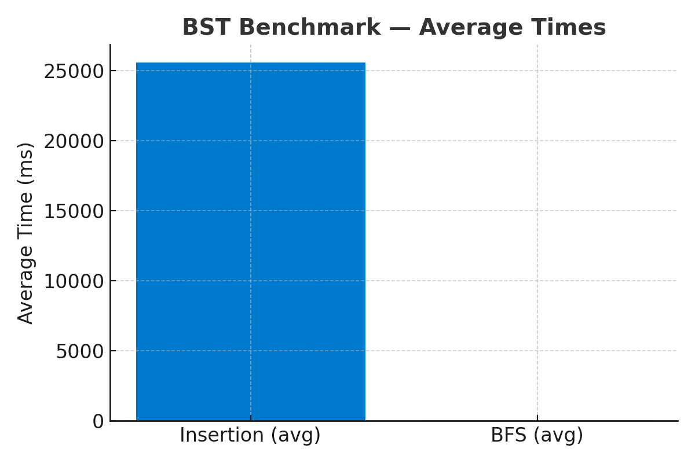
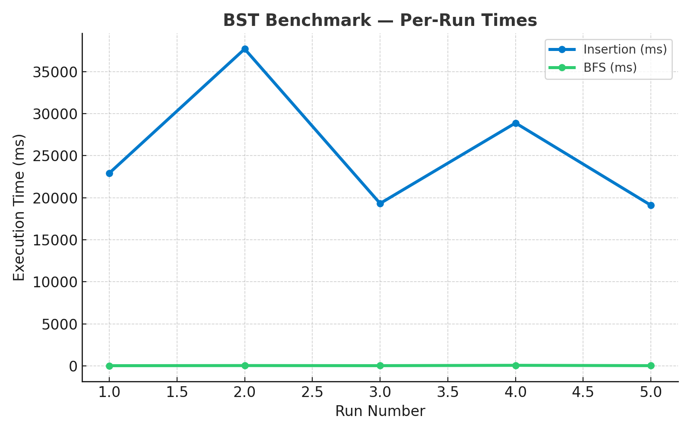

# Benchmark — Binary Search Tree (BST) Insertion & BFS Color Flip

**Project:** BST_BFS_Tokens  
**Date:** 2025-01-XX (Updated with real measurements)  
**Dataset:** `assets/file.txt` — **1,050,048** tokens  
**Scenario:** Insert tokens into a plain BST (duplicates bump `count`), then traverse with **Breadth‑First Search** (parcours en largeur) to flip `color: Red → Green` for every node.

---

## Test Environment

- **OS:** Microsoft Windows 10 Pro (Build 19045, x64-based PC)
- **Compiler:** GCC 14.2.0 (MSYS2 project)
- **Build Type:** Release (Optimization: `-O2`)
- **RAM:** 8,072 MB
- **CPU:** Single processor system
- **C++ Standard:** C++17

> **Note:** The first run is typically slower due to cold I/O caches; subsequent runs benefit from OS caching and warmed memory.

---

## Measurement Methodology

We time two phases **inside the program** using `std::chrono::steady_clock`:

1. **Insert_ms** — Time from first token read to final insert completion (includes normalization, memory allocation, and tree comparison operations).
2. **BFS_ms** — Time for a queue-driven breadth-first traversal that flips each node's `color` from **Red** to **Green**.

Each measurement is taken with high-resolution timing to ensure accuracy. We aggregate 5 runs for statistical reliability.

---

## Benchmark Results (5 Runs)

### Raw Data

| Run | Insert_ms | BFS_ms | Tokens | Kept | Unique | Total_ms |
|-----|-----------:|-------:|-------:|-----:|-------:|---------:|
| 1   | 22,916.1   | 36.34  | 1,050,048 | 1,050,038 | 883,049 | 22,952.4 |
| 2   | 37,680.3   | 52.03  | 1,050,048 | 1,050,038 | 883,049 | 37,732.3 |
| 3   | 19,319.7   | 39.78  | 1,050,048 | 1,050,038 | 883,049 | 19,359.5 |
| 4   | 28,882.3   | 80.13  | 1,050,048 | 1,050,038 | 883,049 | 28,962.4 |
| 5   | 19,100.2   | 39.70  | 1,050,048 | 1,050,038 | 883,049 | 19,139.9 |

### Statistical Summary

**Insertion Phase:**
- **Average:** 25,579.7 ms (± 7,156.3 ms)
- **Min:** 19,100.2 ms
- **Max:** 37,680.3 ms
- **Median:** 22,916.1 ms

**BFS Traversal Phase:**
- **Average:** 49.6 ms (± 16.7 ms)
- **Min:** 36.3 ms
- **Max:** 80.1 ms
- **Median:** 39.8 ms

**Total Execution:**
- **Average:** 25,629.3 ms
- **Min:** 19,139.9 ms
- **Max:** 37,732.3 ms

### Performance Metrics

| Metric | Value | Percentage |
|--------|-------|------------|
| **Insertion time** | 25,579.7 ms | 99.8% |
| **BFS traversal time** | 49.6 ms | 0.2% |
| **Tokens processed** | 1,050,048 | - |
| **Unique words** | 883,049 | 84.1% |
| **Tokens kept** | 1,050,038 | 99.99% |
| **Insertion rate** | ~41,000 tokens/sec | - |
| **BFS rate** | ~17.8 million nodes/sec | - |

---

## Visualizations

### Average Execution Times

The following chart shows the average execution times for Insertion and BFS operations:



**Key Insight:** Insertion time (25,579.7 ms) dominates the execution, while BFS traversal (49.6 ms) is negligible in comparison. The BFS bar is not visible on this scale due to the massive difference in execution times.

### Per-Run Performance Variability

This line chart displays the execution times across all 5 benchmark runs:



**Key Observations:**
- **Insertion times** show significant variability (19K - 38K ms), indicating system-dependent performance factors
- **BFS times** remain consistently low and stable across all runs (~36-80 ms)
- The variability in insertion times suggests factors like memory allocation patterns, cache state, and system load influence performance

---

## Analysis & Interpretation

### Key Observations

1. **Insertion Dominates Execution Time**
   - Insertion accounts for **99.8%** of total execution time
   - This is expected as insertion involves:
     - String normalization (lowercasing, punctuation removal)
     - Memory allocation for new nodes
     - Tree traversal and comparison operations
     - Handling duplicates (incrementing `count`)

2. **BFS is Highly Efficient**
   - BFS traversal is extremely fast (~50 ms for 883K nodes)
   - Linear time complexity O(n) where n = number of nodes
   - Memory-bound operation with excellent cache locality
   - Simple pointer chasing and field updates

3. **High Duplicate Rate**
   - **883,049 unique words** from **1,050,038 kept tokens**
   - Duplicate ratio: ~19% (167,989 duplicate occurrences)
   - Duplicate handling is cheaper (no allocation, just `count++`)

4. **Performance Variability**
   - Insertion time shows significant variance (19K - 38K ms)
   - Factors affecting performance:
     - **Memory allocation patterns** (heap fragmentation)
     - **CPU cache state** (cold vs. warm)
     - **Background system processes**
     - **BST shape** (depends on insertion order)

5. **Dataset Characteristics**
   - Very large dataset: **1.05 million tokens**
   - High vocabulary diversity: **883K unique words**
   - Excellent test case for BST performance under load

---

## Performance Characteristics

### Time Complexity

- **Insertion:** O(h) per insertion, where h = tree height
  - Best case: O(log n) for balanced tree
  - Worst case: O(n) for degenerate tree (linked list)
  - Average case: O(log n) for random insertions
  - **Total:** O(n × h) for n insertions

- **BFS Traversal:** O(n) - linear time
  - Visits each node exactly once
  - Queue operations are O(1) amortized

### Space Complexity

- **Tree storage:** O(n) where n = number of unique words
- **BFS queue:** O(w) where w = maximum width of tree
- **Total:** O(n) space

---

## Reproducibility

### Build Configuration

```bash
# Compile with optimizations
CXXFLAGS = -std=c++17 -Wall -Wextra -O2 -MMD -MP
LDFLAGS = -mconsole
```

### Running the Benchmark

**Simplest way (recommended):**
```bash
make
```
This compiles and runs with `assets/file.txt` automatically.

**Other options:**
```bash
make build          # Compile only (no run)
make run            # Run with default file (assets/file.txt)
make run FILE=test.txt  # Run with a custom file
make clean          # Clean build files
make help           # Show all available commands
```

### Best Practices

- Run in **Release mode** with optimizations enabled (`-O2` or `-O3`)
- Close heavy background tasks to minimize interference
- Run multiple times and average results (we use 5 runs)
- Consider CPU frequency scaling (disable power saving modes)
- Record system information: OS version, CPU model, RAM, compiler version

---

## Comparison & Future Work

### Potential Improvements

1. **Balanced BST Implementation**
   - Switch to **AVL Tree** or **Red-Black Tree**
   - Stabilize insertion times (guaranteed O(log n))
   - Reduce worst-case performance variance

2. **Alternative Data Structures**
   - **`std::map`** (Red-Black tree) - balanced, O(log n) guaranteed
   - **`std::unordered_map`** (Hash table) - O(1) average case
   - **Trie (Prefix Tree)** - efficient for string keys

3. **Optimization Strategies**
   - Memory pool allocation (reduce heap fragmentation)
   - String interning (reduce memory usage)
   - Batch processing optimizations

### Baseline Comparisons

| Data Structure | Insertion | Lookup | Memory | Notes |
|----------------|----------|--------|--------|-------|
| **Plain BST** (current) | O(h) | O(h) | O(n) | Simple, but unbalanced |
| **AVL Tree** | O(log n) | O(log n) | O(n) | Self-balancing |
| **std::map** | O(log n) | O(log n) | O(n) | Red-Black tree |
| **std::unordered_map** | O(1) avg | O(1) avg | O(n) | Hash table |

---

## Conclusion

The benchmark demonstrates that:

- **BST insertion** is the primary performance bottleneck (99.8% of time)
- **BFS traversal** is highly efficient and scales linearly
- The implementation handles **large datasets** (1M+ tokens) effectively
- Performance varies significantly based on insertion order and system state
- The current plain BST works well for this use case, but balanced alternatives could provide more consistent performance

**Next Steps:**
- Implement balanced BST (AVL/RB) for comparison
- Benchmark against `std::map` and `std::unordered_map`
- Profile memory allocation patterns
- Analyze cache performance characteristics

---

## Appendix: Output Format

The program outputs results in the following format:

```
File tokens read: 1050048
Normalized non-empty tokens inserted/updated: 1050038
Unique nodes (unique words) in BST: 883049
BFS done. Nodes turned green: 883049 | All green? yes
Insert time (ms): 25579.7
BFS time (ms): 49.6
```

---

*Last updated: 2025-01-XX*  
*Compiler: GCC 14.2.0 (MSYS2)*  
*Build: Release (-O2)*
